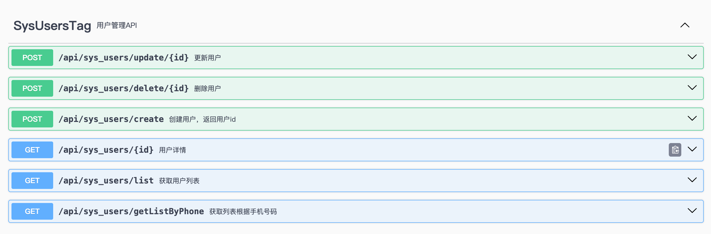
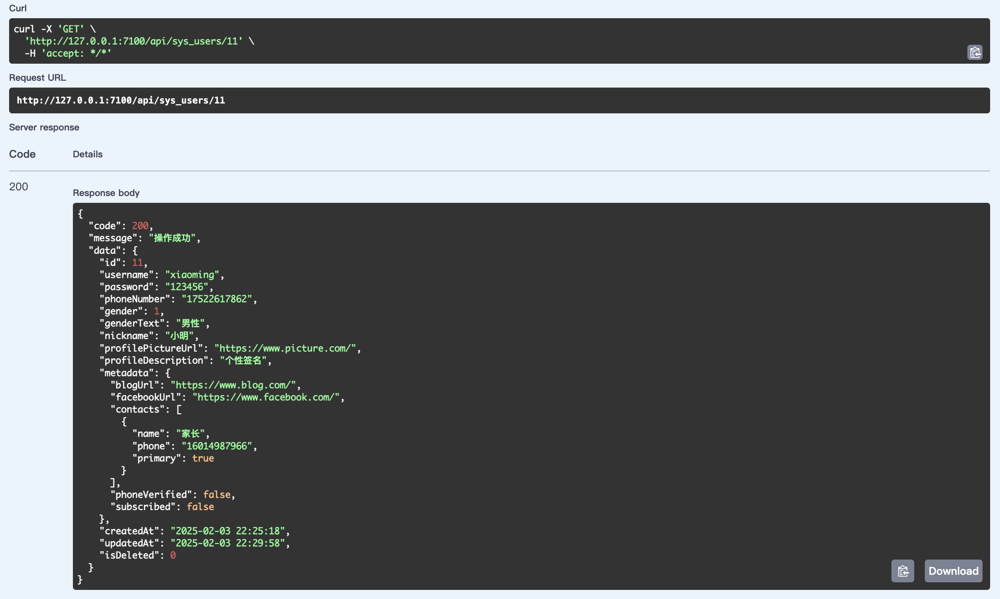

# fast-tiny-springboot

## 简介

⚡️基于springboot的快速开发的框架，可用于现代web服务接口开发，开箱即用。


## 项目展示

**常规的单表CRUD**



**查询详情响应体**




## 技术选型

| 技术                | 版本       | 说明                      |
|:------------------|----------|-------------------------|
| spring-boot       | 3.4.2    | MVC框架，功能包括web服务、检验、切面等等 |
| springdoc-openapi | 2.8.4    | swagger文档生成工具           |
| mysql-connector-j | 9.2.0    | mysql数据库驱动              |
| mybatis-plus      | 3.5.10.1 | ORM框架，MyBatis 增强工具      |
| hutool            | 5.8.35   | Java工具类库                |
| lombok            | 1.18.36  | 简化代码工具                  |


## 使用流程

### 环境搭建

- 数据库默认版本为8.0，支持5.7的版本，数据库需要导入 [初始化脚本](./sql/sys_users.sql)。
- JDK版本需要17以上，项目默认为21，可在`pom`文件中修改。

### 项目运行

直接通过`idea`运行业务模块的`AdminApplication`启动类即可。

### 业务代码开发

通过脚本一件生成代码文件 todo

### 项目部署

通过Docker插件一键部署 todo


## 项目结构

#### 业务模块结构

```shell
├── pom.xml                          #  业务模块的配置文件，定义依赖、插件和构建配置
├── src
│   ├── main
│   │   ├── java
│   │   │   └── admin
│   │   │       ├── AdminApplication.java          # Spring Boot 启动类
│   │   │       ├── config                          # 配置类目录
│   │   │       │   ├── ModuleExceptionHandler.java  # 全局异常处理器
│   │   │       │   ├── MybatisPlusConfig.java      # MyBatis-Plus 配置类
│   │   │       │   └── OpenApiConfig.java          # OpenAPI (Swagger) 配置类
│   │   │       ├── controller                      # 控制器层，处理 HTTP 请求
│   │   │       ├── dto                             # 数据传输对象目录
│   │   │       ├── enums                           # 枚举类目录
│   │   │       ├── mapper                          # MyBatis Mapper 接口目录
│   │   │       ├── model                           # 实体类目录
│   │   │       └── service                         # 服务层目录
│   │   │           └── impl                        # 服务实现类目录
│   │   └── resources
│   │       ├── application-dev.yml      # 开发环境配置文件
│   │       ├── application-prod.yml     # 生产环境配置文件
│   │       ├── application.yml          # 全局配置文件
│   │       ├── mapper                   # MyBatis XML 映射文件目录
│   │       └── static                   # 静态资源目录（CSS/JS/图片等）
│   └── test                             # 测试代码目录
└── target                               # Maven 构建输出目录
```

#### 通用模块结构

```shell
├── src
│   └── main
│       ├── java
│       │   └── common  # 公共模块
│       │       ├── api  # 统一接口响应封装
│       │       │   ├── CommonResult.java  # 统一响应结果包装类（如成功/失败格式）
│       │       │   ├── IErrorCode.java    # 错误码接口（定义错误码规范）
│       │       │   └── ResultCode.java    # 具体错误码枚举（如 200=成功，500=系统错误）
│       │       ├── dto  # 数据传输对象基类
│       │       │   └── BasePages.java     # 分页查询参数基类（包含 pageNum/pageSize）
│       │       ├── exception  # 全局异常处理
│       │       │   ├── ApiException.java         # 自定义业务异常类
│       │       │   └── GlobalExceptionHandler.java  # 全局异常处理器（统一返回错误格式）
│       │       └── validator  # 自定义校验器
│       │           ├── EnumValidator.java  # 枚举校验器实现
│       │           └── ValidEnum.java      # 枚举校验注解
│       └── resources  # 资源文件目录
└── pom.xml  # Maven 公共项目配置文件，只定义通用依赖
```


## 其他说明

- 通过`CommonResult`返回统一的结构体，其中`CommonResult.success`为成功，`CommonResult.failed`为失败。
- 业务异常可通过 `throw new ApiException("xxx")`，全局异常会自动捕获，返回统一错误。
- 枚举的检验，可使用`ValidEnum`注解，如` @ValidEnum(enumClass = GenderEnum.class, message = "性别编码不合法")`。


