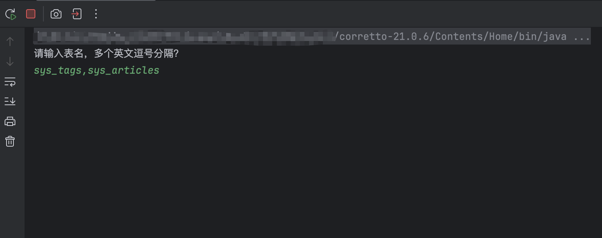
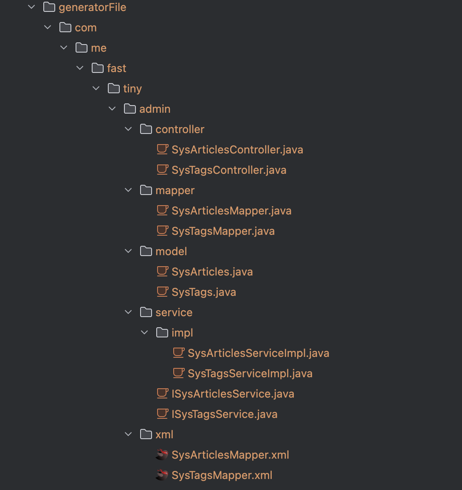
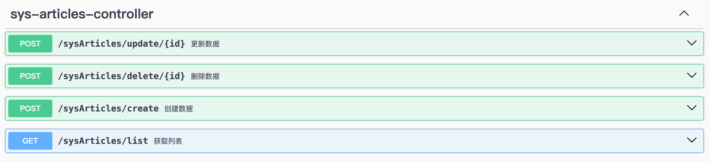

# fast-tiny-springboot

## 简介

⚡️ 基于 springboot 的快速开发的框架，可用于现代 web 服务接口开发，开箱即用。

## 项目展示

**常规的单表 CRUD**


**查询详情响应体**


## 技术选型

| 技术                   | 版本     | 说明                                        |
| :--------------------- | -------- | ------------------------------------------- |
| spring-boot            | 3.4.2    | MVC 框架，功能包括 web 服务、检验、切面等等 |
| springdoc-openapi      | 2.8.4    | swagger 文档生成工具                        |
| mysql-connector-j      | 9.2.0    | mysql 数据库驱动                            |
| mybatis-plus           | 3.5.10.1 | ORM 框架，MyBatis 增强工具                  |
| mybatis-plus generator | 3.5.10.1 | 代码生成器                                  |
| hutool                 | 5.8.35   | Java 工具类库                               |
| lombok                 | 1.18.36  | 简化代码工具                                |

## 使用流程

### 环境搭建

- 数据库默认版本为 8.0，支持 5.7 的版本，数据库初始化运行 [sql 脚本](./sql/sys_users.sql)，可快速运行项目。
- JDK 版本需要 17 以上，项目默认为 21，可在`pom`文件中修改。

### 项目运行

直接通过`idea`运行业务模块的`AdminApplication`启动类即可。

### 业务代码开发

通过`CodeGenerator`一键生成业务代码文件，文件包括 controller、mapper、model、service、xml，并且有可直接运行的 CURD 代码。

1. 设计表字段，并且一定要写好字段的注释，生成器会自动生成在线文档字段说明。
2. 运行代码生成器在 `common`模块中，输入表的名称，如图 
3. 生成的文件在`generatorFile`目录中，手动把生成的文件拖动到业务模块中，文件目录如图 
4. 生成的代码可直接运行，有基础的 curd，生成的在线文档如图 

### 项目部署

通过 Docker 插件一键部署 todo

## 项目结构

#### 业务模块结构

```shell
├── pom.xml                          #  业务模块的配置文件，定义依赖、插件和构建配置
├── src
│   ├── main
│   │   ├── java
│   │   │   └── admin
│   │   │       ├── AdminApplication.java          # Spring Boot 启动类
│   │   │       ├── config                          # 配置类目录
│   │   │       │   ├── ModuleExceptionHandler.java  # 全局异常处理器
│   │   │       │   ├── MybatisPlusConfig.java      # MyBatis-Plus 配置类
│   │   │       │   └── OpenApiConfig.java          # OpenAPI (Swagger) 配置类
│   │   │       ├── controller                      # 控制器层，处理 HTTP 请求
│   │   │       ├── dto                             # 数据传输对象目录
│   │   │       ├── enums                           # 枚举类目录
│   │   │       ├── mapper                          # MyBatis Mapper 接口目录
│   │   │       ├── model                           # 实体类目录
│   │   │       └── service                         # 服务层目录
│   │   │           └── impl                        # 服务实现类目录
│   │   └── resources
│   │       ├── application-dev.yml      # 开发环境配置文件
│   │       ├── application-prod.yml     # 生产环境配置文件
│   │       ├── application.yml          # 全局配置文件
│   │       ├── mapper                   # MyBatis XML 映射文件目录
│   │       └── static                   # 静态资源目录（CSS/JS/图片等）
│   └── test                             # 测试代码目录
└── target                               # Maven 构建输出目录
```

#### 通用模块结构

```shell
├── src
│   └── main
│       ├── java
│       │   └── common  # 公共模块
│       │       ├── api  # 统一接口响应封装
│       │       │   ├── CommonResult.java  # 统一响应结果包装类（如成功/失败格式）
│       │       │   ├── IErrorCode.java    # 错误码接口（定义错误码规范）
│       │       │   └── ResultCode.java    # 具体错误码枚举（如 200=成功，500=系统错误）
│       │       ├── dto  # 数据传输对象基类
│       │       │   └── BasePages.java     # 分页查询参数基类（包含 pageNum/pageSize）
│       │       ├── exception  # 全局异常处理
│       │       │   ├── ApiException.java            # 自定义业务异常类
│       │       │   └── GlobalExceptionHandler.java  # 全局异常处理器（统一返回错误格式）
│       │       ├── generator
│       │       │   └── CodeGenerator.java # 代码生成器
│       │       └── validator  # 自定义校验器
│       │           ├── EnumValidator.java  # 枚举校验器实现
│       │           └── ValidEnum.java      # 枚举校验注解
│       └── resources  # 资源文件目录
└── pom.xml  # Maven 公共项目配置文件，只定义通用依赖
```

## 其他说明

- 通过`CommonResult`返回统一的结构体，其中`CommonResult.success`为成功，`CommonResult.failed`为失败。
- 业务异常可通过 `throw new ApiException("xxx")`，全局异常会自动捕获，返回统一错误。
- 枚举的检验，可使用`ValidEnum`注解，如` @ValidEnum(enumClass = GenderEnum.class, message = "性别编码不合法")`。
