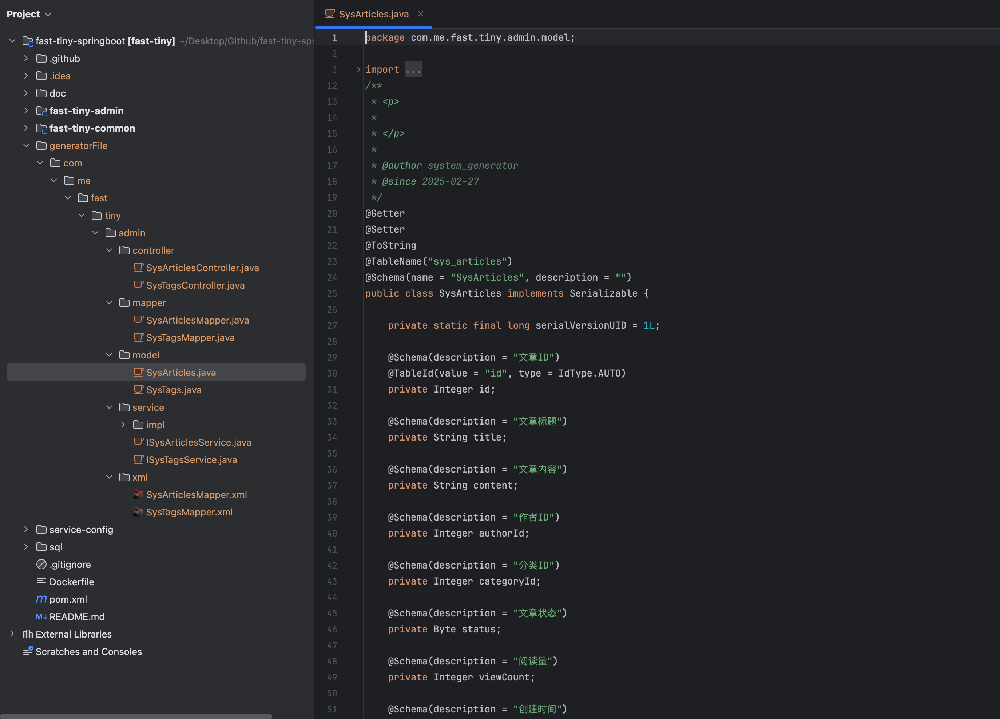

# fast-tiny-springboot

## 简介

基于 springboot 的快速开发的框架，可用于现代 web 服务接口开发，开箱即用，一键部署 🚀

## 项目展示

**常规的单表 CRUD**


**查询详情响应体**


## 技术选型

| 技术                   | 版本     | 说明                                        |
| :--------------------- | -------- | ------------------------------------------- |
| spring-boot            | 3.4.2    | MVC 框架，功能包括 web 服务、检验、切面等等 |
| springdoc-openapi      | 2.8.4    | swagger 文档生成工具                        |
| mysql-connector-j      | 9.2.0    | mysql 数据库驱动                            |
| mybatis-plus           | 3.5.10.1 | ORM 框架，MyBatis 增强工具                  |
| mybatis-plus generator | 3.5.10.1 | 代码生成器                                  |
| hutool                 | 5.8.35   | Java 工具类库                               |
| lombok                 | 1.18.36  | 简化代码工具                                |

## 项目结构

#### 业务模块结构

```shell
├── pom.xml                          #  业务模块的配置文件，定义依赖、插件和构建配置
├── src
│   ├── main
│   │   ├── java
│   │   │   └── admin
│   │   │       ├── AdminApplication.java          # Spring Boot 启动类
│   │   │       ├── config                          # 配置类目录
│   │   │       │   ├── ModuleExceptionHandler.java  # 全局异常处理器
│   │   │       │   ├── MybatisPlusConfig.java      # MyBatis-Plus 配置类
│   │   │       │   └── OpenApiConfig.java          # OpenAPI (Swagger) 配置类
│   │   │       ├── controller                      # 控制器层，处理 HTTP 请求
│   │   │       ├── dto                             # 数据传输对象目录
│   │   │       ├── enums                           # 枚举类目录
│   │   │       ├── mapper                          # MyBatis Mapper 接口目录
│   │   │       ├── model                           # 实体类目录
│   │   │       └── service                         # 服务层目录
│   │   │           └── impl                        # 服务实现类目录
│   │   └── resources
│   │       ├── application-dev.yml      # 开发环境配置文件
│   │       ├── application-prod.yml     # 生产环境配置文件
│   │       ├── application.yml          # 全局配置文件
│   │       ├── mapper                   # MyBatis XML 映射文件目录
│   │       └── static                   # 静态资源目录（CSS/JS/图片等）
│   └── test                             # 测试代码目录
└── target                               # Maven 构建输出目录
```

#### 通用模块结构

```shell
├── src
│   └── main
│       ├── java
│       │   └── common  # 公共模块
│       │       ├── api  # 统一接口响应封装
│       │       │   ├── CommonResult.java  # 统一响应结果包装类（如成功/失败格式）
│       │       │   ├── IErrorCode.java    # 错误码接口（定义错误码规范）
│       │       │   └── ResultCode.java    # 具体错误码枚举（如 200=成功，500=系统错误）
│       │       ├── dto  # 数据传输对象基类
│       │       │   └── BasePages.java     # 分页查询参数基类（包含 pageNum/pageSize）
│       │       ├── exception  # 全局异常处理
│       │       │   ├── ApiException.java            # 自定义业务异常类
│       │       │   └── GlobalExceptionHandler.java  # 全局异常处理器（统一返回错误格式）
│       │       ├── generator
│       │       │   └── CodeGenerator.java # 代码生成器
│       │       └── validator  # 自定义校验器
│       │           ├── EnumValidator.java  # 枚举校验器实现
│       │           └── ValidEnum.java      # 枚举校验注解
│       └── resources  # 资源文件目录
└── pom.xml  # Maven 公共项目配置文件，只定义通用依赖
```

## 使用流程

### 环境搭建

- 数据库默认版本为 8.0，支持 5.7 的版本，数据库初始化运行 [sql 脚本](./sql/sys_users.sql)，可快速运行项目。
- JDK 版本需要 17 以上，项目默认为 17，可在`pom`文件中修改。

### 项目运行

直接通过`idea`运行业务模块的`AdminApplication`启动类即可。

### 业务代码开发

通过`CodeGenerator`一键生成业务代码文件，文件包括 controller、mapper、model、service、xml，并且有可直接运行的 CURD 代码。

代码生成器在 `common -> generator -> CodeGenerator` 模块中，通过 `idea`运行脚本。

1. 设计表字段，并且一定要写好字段的注释，生成器会自动生成在线文档字段说明。
2. 运行代码生成器，输入表的名称，如图 
3. 生成的文件在`generatorFile`目录中，手动把生成的文件拖动到业务模块中，文件目录如图 
4. 生成的代码可直接运行，有基础的 curd，生成的在线文档如图 

## 一键部署

### 准备工作

#### 服务器环境

- 确保服务器已安装 Docker 和 Docker Compose。
- 在服务器上创建项目目录（例如 `/home/admin/fast-tiny-app`），并上传 `docker-compose.yml`和`.env` 文件，具体可参考项目 [服务端配置](./service-config/)

#### ​GitHub Secrets 配置

在仓库的 `Settings -> Secrets -> Actions` 中添加以下密钥：

| Secret 名称        | 作用说明                                            |
| :----------------- | --------------------------------------------------- |
| SERVER_HOST        | 部署服务器的公网 IP                                 |
| SSH_USERNAME       | 登录服务器的 SSH 用户名，默认为 root                |
| SSH_PRIVATE_KEY    | 用于 SSH 登录服务器的私钥内容（需与服务器公钥配对） |
| DOCKERHUB_USERNAME | Docker Hub 账号用户名                               |
| DOCKERHUB_TOKEN    | Docker Hub 的访问令牌                               |

#### docker-compose.yml 和.env 示例

```yml
services:
  app:
    image: ${IMAGE_FULL_NAME}
    container_name: ${IMAGE_NAME}
    restart: unless-stopped
    ports:
      - "7100:7100"
```

```bash
IMAGE_FULL_NAME=domain/my-image:latest
IMAGE_NAME=my-image
```

### 部署步骤

#### 通过 GitHub Actions 手动触发

1. 进入 GitHub 仓库的 ​Actions​ 标签页。
2. 选择 **​Deploy to Server**​ 工作流程，点击 **​Run workflow**。
3. 选择部署环境：
   - daily: 日常环境（默认）。
   - prod: 生产环境。
4. 点击 **​Run workflow**​ 开始部署。
5. 等待构建和部署完成，观察日志是否有错误。

### 验证部署

```bash
# ​检查容器状态​
docker ps -f name=fast-tiny-app
# 查看应用日志
docker logs fast-tiny-app
# 访问应用 URL
open http://<服务器IP>:7100
```

### 注意事项

1. 错误排查
   - 若部署失败，检查 GitHub Actions 日志中的错误信息。
   - 确保服务器的 SSH 密钥权限正确
2. 回滚操作
   若需回滚，可手动在服务器执行：

```bash
cd /home/admin/fast-tiny-app

# 设置环境变量
IMAGE_FULL_NAME="docker.io/xxxx/fast-tiny-app:<标签日期>"
echo "IMAGE_FULL_NAME=$IMAGE_FULL_NAME" > .env
echo "IMAGE_NAME=fast-tiny-app" >> .env

# 重新部署镜像
docker-compose down || true
docker-compose pull
docker-compose up -d
```

## 其他说明

- 通过`CommonResult`返回统一的结构体，其中`CommonResult.success`为成功，`CommonResult.failed`为失败。
- 业务异常可通过 `throw new ApiException("xxx")`，全局异常会自动捕获，返回统一错误。
- 枚举的检验，可使用`ValidEnum`注解，如` @ValidEnum(enumClass = GenderEnum.class, message = "性别编码不合法")`。
